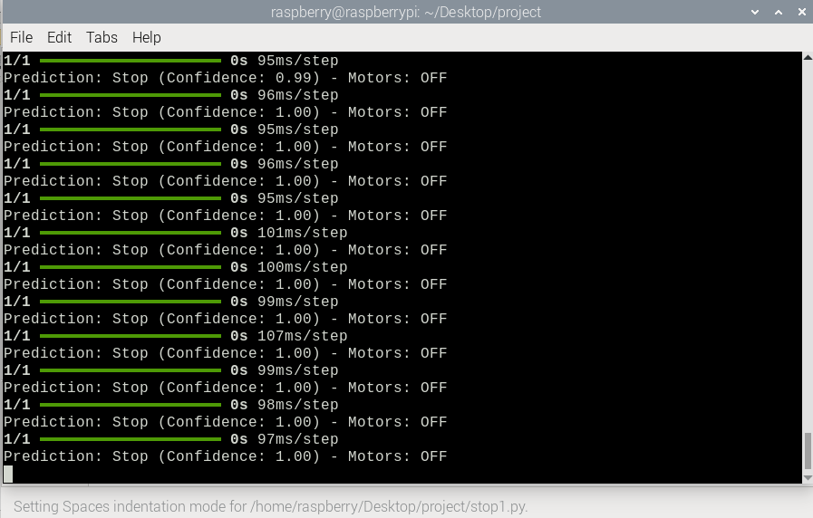
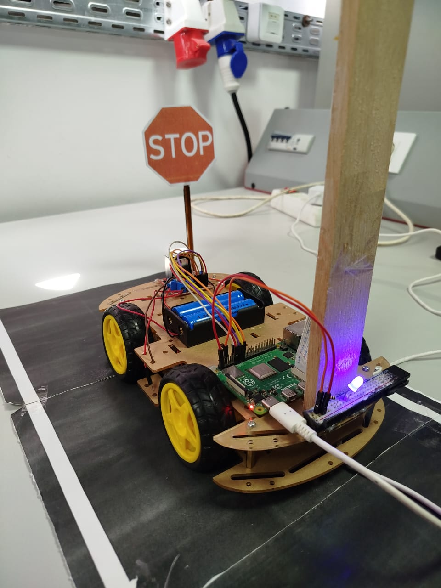
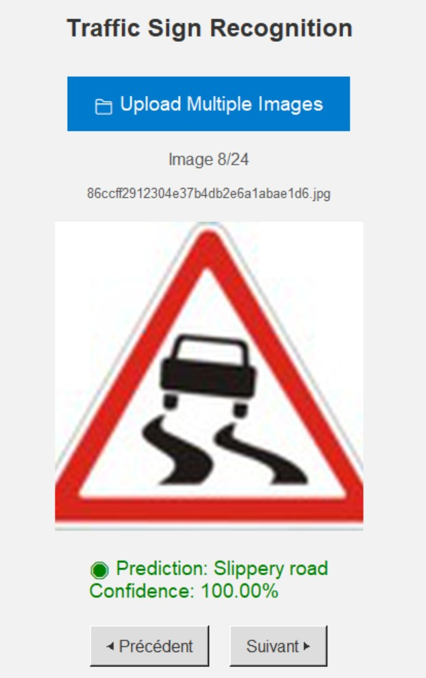

Traffic Sign Recognition System
Project Overview
This project implements a CNN-based traffic sign recognition system using the GTSRB (German Traffic Sign Recognition Benchmark) dataset. The system includes:

A trained deep learning model for classifying 43 traffic sign categories

Real-time detection using Raspberry Pi with camera module

Hardware integration to control DC motors and LED indicators

Desktop GUI for testing and validation

### File Structure

├── GTSRB_CNN.ipynb							# Jupyter notebook for model training  
├── model/                   		# Model files  
│   ├── model_trained_epoch30.p  	# Pretrained model weights  
│   └── traffic_classifiernew.h5 	# Alternative model file  
├── interface/               		# GUI application  
├── scripts/                 		# Camera testing scripts  
│   ├── cameraPC.py      		     # PC camera testing  
│   └── rpiCam.py					 		   # Raspberry Pi camera  
├── images/                		  # Visual assets  
│   ├── GUI.jpg               	 # GUI screenshot  
│   ├── project.jpg           	 # Project setup photo  
│   └── predictions.png       	 # Sample output  
├── Test_images/               # Test images for GUI  
├── predictions/               # RPi camera prediction outputs  
└── README.md                  # Project documentation  

Hardware Requirements (for RPi implementation)

Raspberry Pi 4
PiCamera 2 module
L298N Motor Driver
DC Motors (x2)
LED indicator
Jumper wires

bash
jupyter notebook GTSRB_CNN.ipynb
Key Features
Real-time traffic sign detection

Hardware response to "STOP" signs (motors stop + LED on)

Confidence score display

Multi-image testing interface
